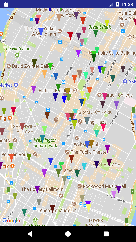
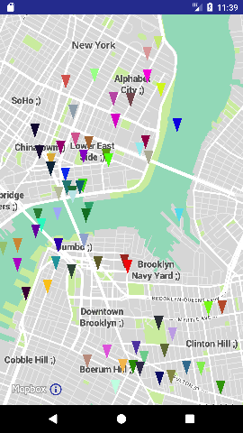

# AndroidMaps - comparing google maps and mapbox performance on android

What is [google maps](https://developers.google.com/maps/)? Learn about the [google maps android sdk](https://developers.google.com/maps/documentation/android-api/)

What is [mapbox](https://www.mapbox.com/)? Learn about the [mapbox android sdk](https://www.mapbox.com/android-docs/map-sdk/overview/)

Does mapbox take less time than google maps when adding a big number of markers on the map?

## Experiments

Two experiments have been timed to compare google maps and mapbox:

Adding markers to the map:

This is simply adding a default marker at some latitude longitude on the map. 
The corresponding map has its own image to represent the marker. 
  
Adding markers with their own icons to the map:
  
This involves having a icon for the marker being added to the map. 
The corresponding map provides and interface to create an icon from bitmaps.

## Images

**Google Maps markers**

**Mapbox markers**

**Google Maps markers with their own icons**

**Mapbox markers with their own icons**

## Results

Run on an a personal android device with:
* 1.7GHz Qualcomm® Snapdragon™ 615 Octa-core CPU
* Adreno 405 @ 550 MHz GPU
* 2GB RAM

The number of markers added are 1000, 3000, 5000.
Each experiment is repeated 100 times to obtain an average. 
The times listed are in milliseconds.

**Adding markers to the map with no icon**

 Map | 1000 markers | 3000 markers | 5000 markers
---- | ------------ | ------------ | ------------
Google Maps | 292.85 | 837.22 | 1263.68
Mapbox | 54.19 | 163.4 | 268.12

**Adding markers each with their own icon** 

Map | 1000 icons + markers | 3000 icons + markers | 5000 icons + markers
---- | ------------ | ------------ | ------------
Google Maps | 1523.87 | 4276.18 | 7573.28
Mapbox | 800.43 | 2631.5 | 5368.35

Map | 1000 icons | 3000 icons | 5000 icons
---- | ------------ | ------------ | ------------
Google Maps | 1209.56 | 3374.05 | 6108.0
Mapbox | 354.42 | 1051.66 | 1743.65

Map | 1000 markers (w icon) | 3000 markers (w icon) | 5000 markers (w icon)
---- | ------------ | ------------ | ------------
Google Maps | 314.31 | 902.13 | 1465.28
Mapbox | 446.01 | 1579.84 |  3624.7

You can view the individual times of the experiments [here](readme/results.md)

## Conclusion

When adding default markers to the map, mapbox is about 5 times faster than google maps.
 
When adding markers each with their own icon, mapbox is faster than google maps.
For 1000 markers mapbox is about 1.9 times faster, 
3000 markers is about 1.6 times faster, 
5000 markers is about 1.4 times faster.

We see that mapbox is faster than google maps when creating icons. 
However, google maps is faster when adding markers that have their own icon. 
But added together, icons and markers, mapbox is faster.

### Installation

If you would like to try it out for your self simply follow the steps below.

1. git clone this repository
1. Copy secrets.example.properties to secrets.properties
1. Enter your google maps and mapbox API keys in secrets.properties
1. Open with Android Studio

You can install the app on a device. 
The app shows the list of experiments to try, you can choose one to try out.

To run the experiments many times and collect an average run individual tests  in MainActivityTest. 
Modify the number of markers and times repeated in the  secrets.gradle file.
