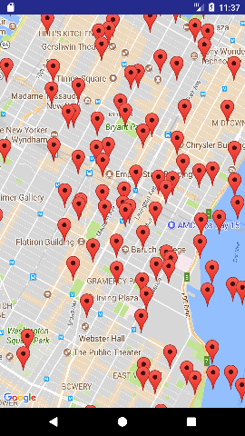
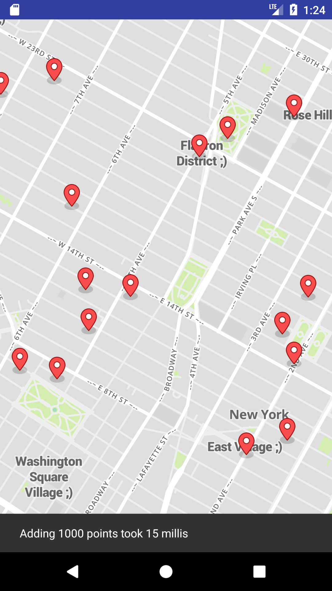

# AndroidMaps - comparing google maps and mapbox performance on android

What is [google maps](https://developers.google.com/maps/)? Learn about the [google maps android sdk](https://developers.google.com/maps/documentation/android-api/)

What is [mapbox](https://www.mapbox.com/)? Learn about the [mapbox android sdk](https://www.mapbox.com/android-docs/map-sdk/overview/)

## Experiments

### Adding 1000 default markers to the map

Google Maps: on average 100 milliseconds

Mapbox: on average 20 milliseconds

## Installation

1. git clone this repository
1. copy secrets.example.properties to secrets.properties
1. Enter your google maps and mapbox API keys in secrets.properties
1. Open with android studio
